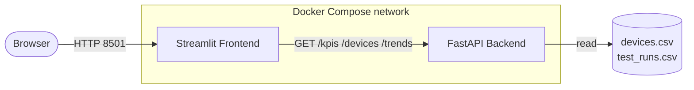

# 📊 Device KPI Dashboard

[](https://github.com/OmarrHegab/KPI-Dashboards/actions/workflows/ci.yml)
[](LICENSE)
[](https://www.python.org/)

A Dockerized **Streamlit + FastAPI** dashboard for monitoring electronic measurement devices in a DevOps / Build Engineering environment.

The backend computes KPIs from device and test-run data and exposes them over a typed REST API; the Streamlit frontend visualizes device health, test pass rates, pipeline success, calibration status, failure Pareto and historical trends.

---

## 🚀 Features

- 📈 KPI overview: device status, test pass rate, pipeline success, test duration
- 🔴 **Calibration tracking** — overdue and due-soon instruments (the headline metric for measurement devices)
- 🧯 **Failure Pareto** — breakdown of failures by error code
- ⏱️ **Duration SLA** — count of tests over the SLA threshold, with p95 and an SLA line on the chart
- 🧩 Firmware-vs-failure and per-location breakdowns
- 📉 **Historical trends** — pass rate & pipeline success over ~8 weeks of test runs
- 🔍 Server-side filtering (status / pipeline) — KPIs and tables stay consistent
- 🛡️ Graceful degradation — a clear message instead of a crash when the backend is down
- 🐳 Dockerized, non-root containers with healthchecks
- ⚙️ CI: lint, format, tested KPI logic with a coverage gate, image security scan, **live integration smoke test**

---

## 🏗️ Architecture



The backend's `/kpis` endpoint is the **single source of truth** for KPI values. The frontend passes its sidebar filters to that endpoint, so the cards are both consistent with the API and reactive to filtering — no duplicated KPI math.

---

## 🛠️ Tech Stack

| Layer    | Technologies                                            |
|----------|---------------------------------------------------------|
| Backend  | Python, FastAPI, Pydantic, Pandas, Uvicorn              |
| Frontend | Streamlit, Plotly                                       |
| DevOps   | Docker, Docker Compose, GitHub Actions, Ruff, Pytest, Trivy, Dependabot, pre-commit |

---

## 📁 Project Structure

```text
KPI-Dashboards/
├── backend/
│   ├── api.py            # FastAPI routes (thin HTTP layer)
│   ├── kpis.py           # pure, unit-tested KPI logic
│   ├── data.py           # CSV loading, caching, error handling
│   ├── models.py         # Pydantic response models
│   └── config.py         # env-based configuration
├── frontend/
│   ├── app.py            # Streamlit dashboard
│   ├── formatting.py     # pure presentation helpers (tested)
│   └── styles.css        # extracted theme
├── data/
│   ├── devices.csv       # device snapshot
│   └── test_runs.csv     # historical test runs (for trends)
├── scripts/
│   └── generate_data.py  # deterministic, seeded data generator
├── tests/                # pytest: KPI units, API (TestClient), data layer, formatting
├── .github/
│   ├── workflows/ci.yml  # CI pipeline
│   └── dependabot.yml    # dependency / action / image updates
├── Dockerfile.backend
├── Dockerfile.frontend
├── docker-compose.yml            # production-faithful stack
├── docker-compose.override.yml   # local dev hot-reload (auto-merged)
├── requirements*.txt             # split & pinned per service
├── pyproject.toml                # ruff + pytest + coverage config
├── Makefile
└── README.md
```

---

## ⚡ Getting Started

### Run with Docker (recommended)

```bash
docker compose up --build
```

| Service        | URL                          |
|----------------|------------------------------|
| Dashboard      | http://localhost:8501        |
| Backend API    | http://localhost:8000        |
| API docs (Swagger) | http://localhost:8000/docs |

The frontend waits for the backend to become **healthy** (compose healthcheck) before starting, so there is no cold-start race.

### Run without Docker

```bash
# 1. install dependencies
pip install -r requirements-dev.txt

# 2. start the backend (terminal 1)
python -m uvicorn backend.api:app --reload      # or: python backend/api.py

# 3. start the frontend (terminal 2)
streamlit run frontend/app.py
```

The frontend reads `BACKEND_URL` (default `http://localhost:8000`), so the local path works out of the box. See `.env.example` for all configuration options.

---

## 🔌 API

| Method | Endpoint    | Description                                              |
|--------|-------------|---------------------------------------------------------|
| GET    | `/`         | Service banner                                          |
| GET    | `/health`   | Liveness probe                                          |
| GET    | `/ready`    | Readiness probe (verifies data is loadable)            |
| GET    | `/devices`  | Device rows; optional `status` / `pipeline_status` / `location` filters |
| GET    | `/kpis`     | Aggregated KPIs (same filters) — single source of truth |
| GET    | `/trends`   | Daily pass-rate / pipeline / duration history          |

Interactive OpenAPI documentation is auto-generated at `/docs`.

---

## ✅ Testing & Quality

```bash
make test        # run the suite
make cov         # run with coverage report + gate
make lint        # ruff lint
make format      # ruff format
```

- **Unit tests** cover the KPI math with known fixtures and edge cases (empty/filtered data is JSON-safe — no `NaN`).
- **API tests** use FastAPI's `TestClient` to assert status codes, the response schema, filter behavior and cross-endpoint invariants.
- **Coverage** is measured and **gated at 85%** (currently ~90% on the backend). The Streamlit UI glue is verified by the CI integration smoke test rather than unit tests.

---

## 🔄 Continuous Integration

Every push and PR to `main` runs [`ci.yml`](.github/workflows/ci.yml):

1. **Lint & Test** on a Python 3.11/3.12 matrix — Ruff lint + format, pytest with a coverage gate, coverage/JUnit artifacts.
2. **Build, Scan & Smoke-Test** — build both images (Buildx layer cache), **Trivy image scan** (HIGH/CRITICAL), then `docker compose up` and **curl the live endpoints** to prove the stack actually boots and serves.
3. **Security** — Trivy filesystem (dependencies/secrets) and config (Dockerfile/compose misconfig) scans.

Hardening: least-privilege `GITHUB_TOKEN`, `concurrency` cancellation, and Dependabot for dependencies, actions and base images.

---

## 🔒 Security

- Containers run as a **non-root** user with HEALTHCHECKs; base images run `apt-get upgrade` for OS fixes.
- Dependencies are **pinned** and split per service (smaller images, smaller attack surface).
- **Trivy** scans the built images, the filesystem and IaC config in CI. Scans are report-only so a single
  upstream CVE outside our control doesn't break the build; **Dependabot** drives remediation by bumping
  dependencies, actions and base images. (Flip the Trivy `exit-code` to `1` to turn any scan into a hard gate.)

---

## 🧪 Demo Data

The dataset is generated deterministically (seeded) so it is reproducible and easy to extend:

```bash
make data        # or: python scripts/generate_data.py
```

It models 42 devices across 4 locations with correlated firmware/failure patterns, a spread of calibration dates, and ~8 weeks of test-run history for the trend charts.

---

## 📌 Future Improvements

- User authentication & role-based access control
- Database integration (replace CSV with Postgres/TimescaleDB)
- PDF / Excel export of KPI reports
- Real-time updates (WebSocket / polling)
- Cloud deployment (container registry + managed compute)

---

## 👨‍💻 Author

**Omar Hegab** — Computer Science Student, University of Freiburg
GitHub: https://github.com/OmarrHegab

## 📄 License

MIT — see [LICENSE](LICENSE).
